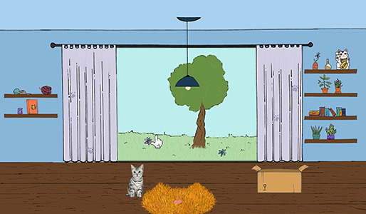
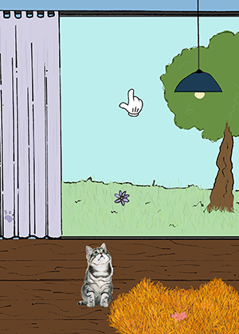
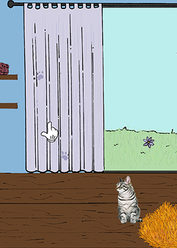
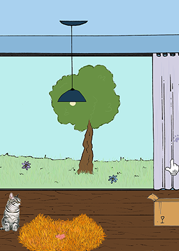
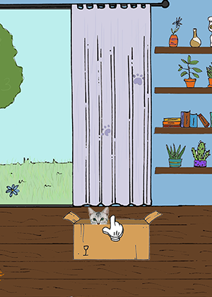
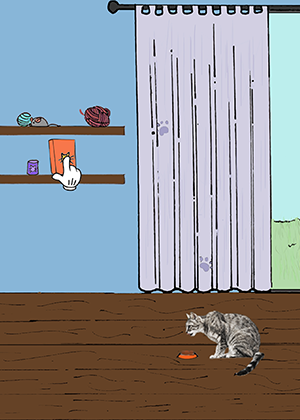
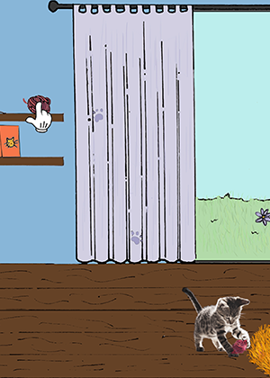
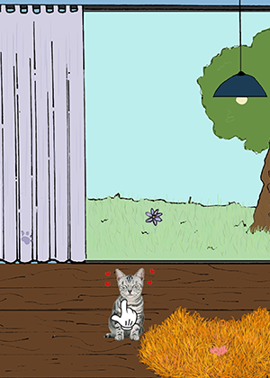

SUPSI 2022-23  
Corso d’interaction design, CV427.01  
Docenti: A. Gysin, G. Profeta  

Elaborato 3: Manipolazione

# Gatto_virtuale
Autrice: Giulia Imperatori  
[MediaPipe demo-ES6] https://giuliaimperatori.github.io/gatto_virtuale/

## Introduzione e tema
Lo scopo di questo progetto è quello di poter interagire con un interfaccia attraverso l'uso delle mani. Nel mio caso, ho realizzato un mini gioco in cui è possibile interagire con un gatto virtuale attraverso la posizione dell'indice sullo schermo, il quale è rappresentato da una mano, per poter capire dove si trova il dito sullo schermo. Il gatto segue il dito con la testa e se si posiziona l'indice su uno degli oggetti che corrisponde ad un'azione, il gatto risponderà di conseguenza svolgendo quella determinata azione. Ad esempio, se il dito si trova sullo scatolone, il gatto si troverà al suo interno. Le azioni disponibili sono: 
- dito nella parte centrale dello schermo, gatto non fa nulla
- dito nella parte superiore dello schermo, gatto guarda in alto
- dito nella parte sinistra dello schermo, gatto guarda a sinistra
- dito nella parte destra dello schermo, gatto guarda a destra
- dito su scatolone, gatto dentro scatolone
- dito su scatola cibo, gatto mangia dalla ciotola
- dito su gomitolo, gatto gioca con gomitolo
- diito su gatto, gatto fa le fusa

## Riferimenti progettuali
Per l'idea del gatto virtuale, mi sono ispirata al Tamagotchi, un mini gioco elettronico portatile giapponese pensato per un giocatore singolo. Il gioco consiste nell'interazione tra il giocatore e l'animale virtuale, quest'ultimo va accudito come un'animale domestico.

https://static.fnac-static.com/multimedia/Images/FR/MDM/8c/e3/00/16835468/1520-1/tsp20230110111849/Jouet-a-manipuler-Tamagotchi-Original-Modele-aleatoire.jpg

## Design dell’interfraccia e modalià di interazione
Ho realizzato lo sfondo e gli oggeti su carta con una penna nera, per poi aggiungere i colori con photoshop, per il gatto, ho utilizzato delle immagini prese dal web, modificandole con photoshop beta, ovvero con l'aiuto dell'intelligenza artificiale. L’interazione con il gatto è possibile grazie alla funzione Detector di MediaPipe, che riconosce il punto sull'indice, al quale ho associato una piccola mano, in modo tale da capire dove si trova l'indice, dato che non si vede la webcam. 

## Tecnologia usata
Per far in modo che l'immagine del gatto cambiasse in base alla posizione del dito, ho definito "hand", ovvero la mano che compare sopra l'indice, con la posizione myXA, myYA, dopodiché ho disegnato su un foglio di carta un rettangolo, ovvero lo schermo, e l'ho suddiviso in rettangoli ragionando sulla disequazione da utilizzare, prima semplificandola e poi traducendola nel linguaggio corretto: "px > gx e px < gx + gw e py > gy e py < gy + gh", p sta per "punto", g sta per "gatto" w sta per "larghezza" e h sta per "altezza", tradotto nel linguaggio del codice: "if (myXA > catX && myXA < catX + catW && myYA > catY && myYA < catY + catH)"

     push()
	image (house, houseX, houseY);
	image (mensole_1, mensole_1X, mensole_1Y)
	image (mensole_2, mensole_2X, mensole_2Y)
	image (food, foodX, foodY);
	image (ball_wool, ball_woolX, ball_woolY);
	image (box, boxX, boxY);
	pop()

	push()
	image (hand, myXA, myYA);
	pop()
			
	myXA = map(indice.x - 34, 0,640,0,windowWidth)
	myYA = map(indice.y - 40, 0,480,0,windowHeight)

	//se indice su gomitolo disegna gatto che gioca
	if (myXA > ball_woolX && myXA < ball_woolX + ball_woolW && myYA > ball_woolY && myYA < ball_woolY + ball_woolH) {
	cat_image = image (cat_playing, 620, 970)
				
	}

	//se inidce su cibo disegna gatto che mangia dalla ciotola
	else if (myXA > foodX && myXA < foodX + foodW && myYA > foodY && myYA < foodY + foodH) {
		cat_image = image (cat_eating, 460, 950)
		cat_image = image (bowl, 440, 1040)
	}

	//se indice su scatolone disegna gatto dentro scatola
	else if (myXA > boxX && myXA < boxX + boxW && myYA > boxY && myYA < boxY + boxH) {
		cat_image = image (cat_head, boxX+80, boxY-12)
		image (hand, myXA, myYA);

	} 

	//se indice da altre parti disegna gatto al centro della stanza
	else {
		cat_image = cat_sitting
 
		//se indice su gatto disegna cuoricini
		if (myXA > catX && myXA < catX + catW && myYA > catY && myYA < catY + catH) {
			cat_image = cat_with_hearts
			flag = 1
		} 
	
 		//se indice a sinistra del gatto, guarda a sinistra
		else if (myXA < width/3){
		cat_image = cat_looking_left
		}
 	
		//se indice al centro della stanza gatto guarda dritto
		else if (myXA > width/3 && myXA < width/3*2) {
			cat_image = cat_sitting
				} 
		//se inidce a destra il gatto guarda a destra
		else {
			cat_image = cat_looking_right
		}
 
		//se indice in alto, gatto guarda su
		if (myYA < height/2)
		cat_image = cat_looking_up

				
		}

	image (cat_image, catX, catY);
	if(flag == 1){
		image (hand, myXA, myYA);
		flag = 0

## Target e contesto d’uso
Potrebbe essere utilizzato come mini gioco online ed è interessante perché al posto del mouse si utilizza il dito. Sviluppando altre funzioni, potrebbe diventare un gioco con dei livelli da superare, ad esempio, se il gatto viene accudito in modod corretto, questo si dimostra felice e in buona salute.

https://github.com/giuliaimperatori/gatto_virtuale/assets/126774277/8cbf9fd8-2180-4d5e-a9aa-45173857d398

